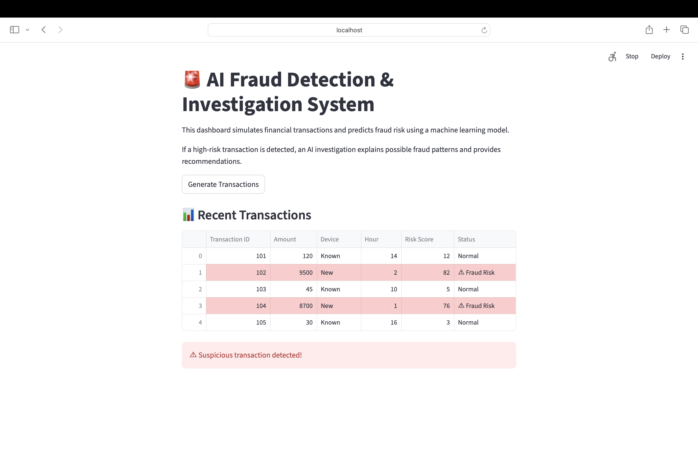
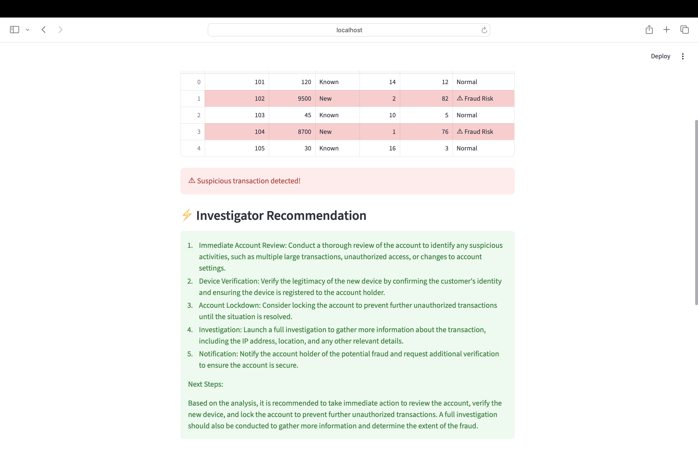
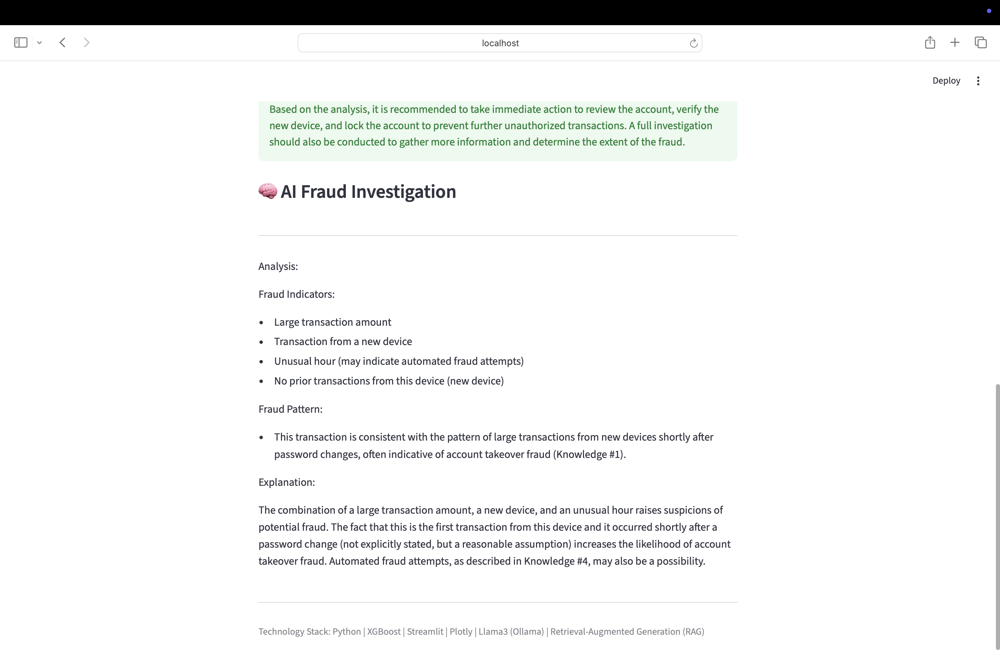

## AI Fraud Detection & Investigation System
This project demonstrates an end-to-end AI system that detects suspicious financial transactions and automatically generates an investigation report using machine learning and large language models.

The system simulates financial transactions, predicts fraud risk using a trained model, retrieves known fraud patterns using a vector search system, and generates an AI-powered investigation explaining the potential fraud scenario.

The goal of this project is to demonstrate how machine learning models, retrieval systems, and large language models can work together to support fraud analysts and investigators.

## Project Overview
Financial institutions process millions of transactions daily. Detecting fraudulent activity quickly is critical to prevent financial losses.

This system simulates how a modern fraud detection pipeline works:

- A transaction is evaluated by a machine learning fraud detection model.
- High-risk transactions are flagged.
- Relevant fraud patterns are retrieved from a knowledge base.
- A large language model analyzes the transaction and produces an investigation report.
- The results are presented in an interactive dashboard.

## System Architecture

The system combines a machine learning fraud detection model with a Retrieval-Augmented Generation (RAG) pipeline to investigate suspicious transactions.

```
Transaction Data
        │
        ▼
Fraud Detection Model (XGBoost)
        │
        ▼
Fraud Risk Score
        │
        ▼
High-Risk Transaction Trigger
        │
        ▼
RAG Pipeline
   │
   ├── Vector Search (FAISS)
   │       │
   │       ▼
   │   Fraud Pattern Knowledge Base
   │
   ▼
Large Language Model (Llama3 via Ollama)
        │
        ▼
AI Fraud Investigation Report
        │
        ▼
Streamlit Dashboard
```

## Features
**Fraud Detection Model**
- Predicts fraud probability using a trained XGBoost model
- Evaluates simulated financial transactions
**Fraud Monitoring Dashboard**
- Interactive Streamlit interface
- Fraud risk gauge visualization
- Transaction monitoring table
- Suspicious transactions highlighted automatically
**AI Fraud Investigation**
- When a suspicious transaction is detected, the system:
- Identifies fraud indicators
- Retrieves known fraud patterns
- Generates an investigation explanation
- Provides investigator recommendations
**Retrieval Augmented Generation (RAG)**
Fraud knowledge is stored in a local dataset and retrieved using semantic search before generating the investigation report.

**Dashboard Output**
The dashboard includes:
- Fraud Risk Score gauge
- Recent transactions table
- Suspicious transaction alerts
- AI-generated investigation report
- Fraud pattern explanation
- Investigator recommendations

**Technology Stack**
- Python
- Streamlit
- XGBoost
- Plotly
- FAISS (Vector Search)
- Llama3 (via Ollama)
- Retrieval-Augmented Generation (RAG)

## Dashboard Preview

### Fraud Detection Dashboard


### Fraud Investigation Recommendation


### AI Fraud Investigation


**How to Run the Project**
1. Clone the repository
git clone https://github.com/your-username/ai-fraud-detection-rag.git
cd ai-fraud-detection-rag
2. Install dependencies
pip install -r requirements.txt
3. Start Ollama and load Llama3
ollama run llama3
4. Run the dashboard
streamlit run fraud_dashboard.py
Open your browser:
http://localhost:8501

**Example Fraud Indicators**
- The system analyzes transactions using patterns such as:
- Large transaction amounts
- Transactions from new devices
- Unusual transaction hours
- Rapid sequences of transactions
- Suspicious merchant activity

These patterns are retrieved from a fraud knowledge base and used by the AI model to generate investigation explanations.

**Project Goals**
This project demonstrates practical applications of:
- Machine learning fraud detection
- AI-assisted fraud investigation
- Retrieval-Augmented Generation (RAG)
- Vector similarity search
- Interactive data applications

The system uses a Retrieval-Augmented Generation (RAG) architecture to enhance the investigation capability of the large language model.

When a high-risk transaction is detected by the machine learning model, the system retrieves similar fraud patterns from a knowledge base using vector similarity search (FAISS). These retrieved patterns are provided as context to the Llama3 language model, allowing it to generate a more accurate and context-aware fraud investigation report.

This approach improves the reliability of AI-generated explanations by grounding them in known fraud cases.